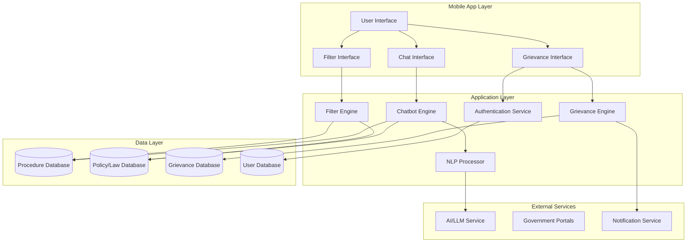

# Design Document: Government Process Assistant

## Overview

The Government Process Assistant is an AI-powered mobile application that provides conversational guidance for Indian government procedures. The system consists of three core components:

1. **AI Chatbot Engine**: Natural language processing system that understands user queries in multiple Indian languages and provides step-by-step procedural guidance
2. **Filtering and Discovery System**: Enables users to browse and filter government services based on policies, laws, and citizen rights
3. **Grievance Management System**: Secure complaint filing and tracking mechanism for reporting issues during government processes

The application follows a mobile-first architecture with offline capabilities, multilingual support, and end-to-end encryption for sensitive data.

## Architecture

### High-Level Architecture



### Component Interaction Flow

1. **Chatbot Flow**: User query → NLP Processing → Intent Recognition → Context Management → Response Generation → Procedure Retrieval → Formatted Response
2. **Filter Flow**: User selects filters → Query Construction → Database Filtering → Result Ranking → Display Results
3. **Grievance Flow**: User initiates complaint → Authentication → Form Submission → Encryption → Storage → Tracking Number Generation → Notification Setup

## Components and Interfaces

### 1. Chatbot Engine

**Responsibilities:**
- Process natural language queries in multiple languages
- Maintain conversation context across messages
- Generate step-by-step procedural guidance
- Handle clarifying questions for ambiguous queries

**Interfaces:**

```typescript
interface ChatbotEngine {
  processMessage(userId: string, message: string, language: string): Promise<ChatResponse>
  getConversationHistory(userId: string, sessionId: string): Promise<Message[]>
  clearContext(userId: string, sessionId: string): Promise<void>
}

interface ChatResponse {
  message: string
  procedureSteps?: ProcedureStep[]
  clarifyingQuestions?: string[]
  links?: ExternalLink[]
  relatedRights?: CitizenRight[]
}

interface ProcedureStep {
  stepNumber: number
  description: string
  requiredDocuments?: string[]
  estimatedTime?: string
  officialFee?: number
}
```

### 2. NLP Processor

**Responsibilities:**
- Language detection and translation
- Intent classification (query type: procedure, document, fee, timeline, rights)
- Entity extraction (service name, state, department)
- Sentiment analysis for grievance detection

**Interfaces:**

```typescript
interface NLPProcessor {
  detectLanguage(text: string): Promise<string>
  classifyIntent(text: string, language: string): Promise<Intent>
  extractEntities(text: string, language: string): Promise<Entity[]>
  translateToEnglish(text: string, sourceLanguage: string): Promise<string>
}

interface Intent {
  type: 'procedure' | 'document' | 'fee' | 'timeline' | 'rights' | 'grievance'
  confidence: number
  governmentService?: string
}

interface Entity {
  type: 'service' | 'state' | 'department' | 'policy' | 'law' | 'right'
  value: string
  confidence: number
}
```

### 3. Filter Engine

**Responsibilities:**
- Apply policy, law, and rights-based filters
- Combine multiple filter criteria
- Rank and sort filtered results
- Suggest alternative filters when results are empty

**Interfaces:**

```typescript
interface FilterEngine {
  applyFilters(filters: FilterCriteria): Promise<FilteredResults>
  combineFilters(filters: FilterCriteria[]): Promise<FilteredResults>
  suggestAlternatives(emptyFilters: FilterCriteria): Promise<FilterSuggestion[]>
}

interface FilterCriteria {
  policies?: string[]
  laws?: string[]
  rights?: string[]
  states?: string[]
  departments?: string[]
  categories?: string[]
}

interface FilteredResults {
  services: GovernmentService[]
  totalCount: number
  appliedFilters: FilterCriteria
}

interface GovernmentService {
  id: string
  name: string
  description: string
  governingPolicies: Policy[]
  governingLaws: Law[]
  relatedRights: CitizenRight[]
  state?: string
  department: string
  category: string
}
```

### 4. Grievance Engine

**Responsibilities:**
- Handle grievance submission with encryption
- Generate unique tracking numbers
- Store grievances securely
- Track status changes and send notifications
- Implement rate limiting

**Interfaces:**

```typescript
interface GrievanceEngine {
  submitGrievance(grievance: GrievanceSubmission): Promise<GrievanceReceipt>
  trackGrievance(trackingNumber: string, userId: string): Promise<GrievanceStatus>
  addFollowUp(trackingNumber: string, comment: string, evidence?: File[]): Promise<void>
  getUserGrievances(userId: string): Promise<Grievance[]>
  checkRateLimit(userId: string): Promise<boolean>
}

interface GrievanceSubmission {
  userId: string
  serviceId: string
  issueType: 'bribe' | 'delay' | 'harassment' | 'misinformation' | 'other'
  description: string
  evidence: File[]
  anonymous: boolean
  location?: string
}

interface GrievanceReceipt {
  trackingNumber: string
  submittedAt: Date
  expectedResolutionTime: string
}

interface GrievanceStatus {
  trackingNumber: string
  status: 'submitted' | 'under_review' | 'investigating' | 'resolved' | 'closed'
  lastUpdated: Date
  comments: Comment[]
}
```

### 5. Authentication Service

**Responsibilities:**
- User registration and login
- Session management
- Secure password storage
- Token generation and validation

**Interfaces:**

```typescript
interface AuthenticationService {
  register(phone: string, password: string): Promise<User>
  login(phone: string, password: string): Promise<AuthToken>
  validateToken(token: string): Promise<boolean>
  logout(userId: string): Promise<void>
  deleteAccount(userId: string): Promise<void>
}

interface User {
  id: string
  phone: string
  preferredLanguage: string
  createdAt: Date
}

interface AuthToken {
  token: string
  expiresAt: Date
  userId: string
}
```

## Data Models

### Procedure Database Schema

```typescript
interface Procedure {
  id: string
  serviceName: string
  description: string
  steps: ProcedureStep[]
  requiredDocuments: Document[]
  officialFees: Fee[]
  estimatedTimeline: string
  governingPolicies: string[]  // Policy IDs
  governingLaws: string[]      // Law IDs
  relatedRights: string[]      // Right IDs
  state?: string               // null for central services
  department: string
  category: string
  officialPortalLink: string
  contactInfo: ContactInfo
  lastUpdated: Date
}

interface Document {
  name: string
  description: string
  example?: string
  mandatory: boolean
}

interface Fee {
  description: string
  amount: number
  currency: 'INR'
}

interface ContactInfo {
  office: string
  phone?: string
  email?: string
  address?: string
}
```

### Policy/Law Database Schema

```typescript
interface Policy {
  id: string
  name: string
  description: string
  category: string
  applicableStates: string[]  // empty array means all India
  relatedServices: string[]   // Service IDs
  officialDocument?: string   // URL to official policy document
}

interface Law {
  id: string
  name: string
  actNumber: string
  description: string
  enactedDate: Date
  applicableStates: string[]
  relatedServices: string[]
  relatedRights: string[]
  officialDocument?: string
}

interface CitizenRight {
  id: string
  name: string
  description: string
  legalBasis: string[]        // Law IDs
  category: string
  applicableServices: string[]
  howToExercise: string
}
```

### Grievance Database Schema

```typescript
interface Grievance {
  id: string
  trackingNumber: string
  userId: string
  serviceId: string
  issueType: string
  description: string          // Encrypted
  evidence: EncryptedFile[]
  anonymous: boolean
  location?: string
  status: string
  submittedAt: Date
  lastUpdated: Date
  comments: Comment[]
  resolutionDetails?: string
}

interface EncryptedFile {
  filename: string
  encryptedData: Buffer       // AES-256 encrypted
  mimeType: string
  size: number
}

interface Comment {
  author: 'user' | 'authority'
  text: string
  timestamp: Date
}
```

### User Database Schema

```typescript
interface UserAccount {
  id: string
  phone: string                // Hashed
  passwordHash: string         // bcrypt
  preferredLanguage: string
  createdAt: Date
  lastLogin: Date
  conversationSessions: Session[]
  grievanceCount: number
  lastGrievanceDate?: Date
}

interface Session {
  sessionId: string
  startedAt: Date
  lastActivity: Date
  context: ConversationContext
}

interface ConversationContext {
  messages: Message[]
  currentService?: string
  userState?: string
  userDepartment?: string
}

interface Message {
  role: 'user' | 'assistant'
  content: string
  timestamp: Date
}
```


## Correctness Properties

A property is a characteristic or behavior that should hold true across all valid executions of a system—essentially, a formal statement about what the system should do. Properties serve as the bridge between human-readable specifications and machine-verifiable correctness guarantees.

### Chatbot Properties

**Property 1: Service Query Completeness**
*For any* valid government service query, the chatbot response SHALL contain procedure steps with descriptions.
**Validates: Requirements 1.2**

**Property 2: Conversation Context Persistence**
*For any* sequence of messages within a session, the conversation context SHALL be retrievable and SHALL contain all previous messages in order.
**Validates: Requirements 1.3**

**Property 3: Ambiguity Handling**
*For any* ambiguous query (queries that match multiple services or lack required parameters), the chatbot response SHALL contain clarifying questions and SHALL NOT contain complete procedure steps.
**Validates: Requirements 1.4**

**Property 4: Multilingual Processing**
*For any* supported language (22 Indian languages + English), when a query is submitted in that language, the system SHALL process it and return a response in the same language.
**Validates: Requirements 1.5**

**Property 5: Document Information Completeness**
*For any* government service that has required documents, when a user requests document information, the response SHALL contain all required documents with descriptions.
**Validates: Requirements 1.6**

**Property 6: Fee Information Accuracy**
*For any* government service with associated fees, when a user requests fee information, the response SHALL contain the official fee amount and currency.
**Validates: Requirements 1.7**

**Property 7: Timeline Information Provision**
*For any* government service, when a user requests timeline information, the response SHALL contain an estimated processing duration.
**Validates: Requirements 1.8**

**Property 8: Portal Link Validity**
*For any* government service, the chatbot response SHALL include a valid URL to the official government portal (URL format validation).
**Validates: Requirements 1.9**

**Property 9: State-Specific Guidance**
*For any* government service that varies by state, if the user has not specified a state in the conversation context, the chatbot SHALL request the user's state before providing complete procedure steps.
**Validates: Requirements 1.10**

### Filter Properties

**Property 10: Policy Filter Correctness**
*For any* policy filter applied, all returned government services SHALL be governed by that policy, and all services in the database governed by that policy SHALL be included in the results.
**Validates: Requirements 2.1**

**Property 11: Law Filter Correctness**
*For any* law filter applied, all returned items (services and rights) SHALL be related to that law in the database.
**Validates: Requirements 2.2**

**Property 12: Rights Filter Correctness**
*For any* citizen right filter applied, all returned government services SHALL exercise or protect that right according to the database relationships.
**Validates: Requirements 2.3**

**Property 13: Filter Combination (Intersection)**
*For any* set of multiple filters applied simultaneously, the returned results SHALL satisfy all filter criteria (set intersection of individual filter results).
**Validates: Requirements 2.4**

**Property 14: Service Metadata Completeness**
*For any* government service displayed, the response SHALL include all governing policies and laws associated with that service in the database.
**Validates: Requirements 2.5**

**Property 15: Procedure Rights Information**
*For any* procedure that has related citizen rights in the database, the chatbot response SHALL include explanations of those rights.
**Validates: Requirements 2.6**

**Property 16: Rights Query Information**
*For any* query about citizen rights, the chatbot response SHALL include rights information with legal references (law IDs or act numbers).
**Validates: Requirements 2.8**

**Property 17: Additional Filter Types**
*For any* government service, it SHALL be filterable by at least one of: state, department, or service category.
**Validates: Requirements 2.9**

**Property 18: Empty Results Handling**
*For any* filter combination that yields zero results, the system SHALL return at least one alternative filter suggestion or related content item.
**Validates: Requirements 2.10**

### Grievance Properties

**Property 19: File Size Validation**
*For any* file attachment to a grievance, if the file size is ≤ 10MB, it SHALL be accepted; if the file size is > 10MB, it SHALL be rejected with an error message.
**Validates: Requirements 3.2**

**Property 20: Grievance Encryption Before Transmission**
*For any* grievance submission, the grievance data SHALL be encrypted before transmission (verifiable by checking that transmitted data is not plain text).
**Validates: Requirements 3.3**

**Property 21: Tracking Number Uniqueness**
*For any* two distinct grievance submissions, their tracking numbers SHALL be different (uniqueness property).
**Validates: Requirements 3.4**

**Property 22: Grievance Storage Encryption**
*For any* grievance stored in the database, the description and evidence fields SHALL be encrypted (not stored as plain text).
**Validates: Requirements 3.5**

**Property 23: User Grievance Retrieval Completeness**
*For any* user, when they request their grievances, the system SHALL return all grievances submitted by that user with current status information.
**Validates: Requirements 3.6**

**Property 24: Status Change Notification**
*For any* grievance status change, a push notification SHALL be queued for the user who submitted the grievance.
**Validates: Requirements 3.7**

**Property 25: Grievance Update Capability**
*For any* existing grievance, the system SHALL allow the submitting user to add follow-up comments and additional evidence files.
**Validates: Requirements 3.8**

**Property 26: Resolution Timeline Provision**
*For any* grievance, the system SHALL provide expected resolution timeline information in the grievance receipt or status response.
**Validates: Requirements 3.9**

**Property 27: Anonymity Protection**
*For any* grievance marked as anonymous, the user's personal identifying information (phone, user ID) SHALL NOT be included in the grievance data forwarded to authorities.
**Validates: Requirements 3.10**

**Property 28: Chatbot Grievance Guidance**
*For any* query about filing a grievance or reporting issues, the chatbot response SHALL include step-by-step guidance for the grievance filing process.
**Validates: Requirements 3.11**

**Property 29: Rate Limiting Enforcement**
*For any* user, if they have submitted 5 grievances in the current day (24-hour period), any additional grievance submission SHALL be rejected with a rate limit error.
**Validates: Requirements 3.12**

## Error Handling

### Chatbot Error Scenarios

1. **Language Detection Failure**: If language cannot be detected, default to English and notify user
2. **Service Not Found**: If queried service doesn't exist, suggest similar services based on text similarity
3. **AI Service Timeout**: If AI/LLM service doesn't respond within 5 seconds, return cached response or error message
4. **Invalid State**: If user provides invalid state name, list valid states and ask for clarification
5. **Context Overflow**: If conversation context exceeds 50 messages, archive older messages and maintain recent 20

### Filter Error Scenarios

1. **Invalid Filter Value**: If filter value doesn't exist in database, return error with valid options
2. **Database Connection Failure**: Return cached results if available, otherwise show error with retry option
3. **Empty Results**: Provide alternative suggestions based on relaxed filter criteria

### Grievance Error Scenarios

1. **File Upload Failure**: Retry upload up to 3 times, then allow user to continue without that file
2. **Encryption Failure**: Abort submission and log error, notify user to retry
3. **Rate Limit Exceeded**: Return clear error message with time until next submission allowed
4. **Authentication Failure**: Redirect to login and preserve grievance draft
5. **Network Failure During Submission**: Queue grievance locally and submit when connection restored

### Security Error Scenarios

1. **Invalid Token**: Force re-authentication
2. **Suspicious Activity**: Temporarily lock account and require verification
3. **SQL Injection Attempt**: Sanitize input and log security event
4. **XSS Attempt**: Escape all user input before display

## Testing Strategy

### Dual Testing Approach

The system will employ both unit testing and property-based testing to ensure comprehensive coverage:

- **Unit tests**: Verify specific examples, edge cases, and error conditions
- **Property tests**: Verify universal properties across all inputs using randomized test data

### Unit Testing Focus

Unit tests will focus on:
- Specific examples that demonstrate correct behavior (e.g., "passport application" query returns passport procedure)
- Integration points between components (e.g., Chatbot → NLP → Database)
- Edge cases (empty strings, special characters, maximum lengths)
- Error conditions (network failures, invalid inputs, authentication failures)
- Security scenarios (SQL injection attempts, XSS attempts)

### Property-Based Testing Configuration

Property-based tests will:
- Use a PBT library appropriate for the implementation language (e.g., Hypothesis for Python, fast-check for TypeScript)
- Run a minimum of 100 iterations per property test
- Generate random but valid test data (services, users, queries, grievances)
- Reference design document properties using tags

**Tag Format**: `Feature: government-process-assistant, Property {number}: {property_text}`

Example:
```typescript
// Feature: government-process-assistant, Property 1: Service Query Completeness
test('chatbot returns procedure steps for any valid service query', async () => {
  // Property-based test with 100+ iterations
});
```

### Property Test Coverage

Each of the 29 correctness properties listed above will be implemented as a property-based test. The tests will:

1. **Generate random valid inputs** (services, queries, filters, grievances)
2. **Execute the system operation** (chatbot query, filter application, grievance submission)
3. **Assert the property holds** (response contains required data, filters work correctly, encryption is applied)

### Test Data Generation

Property tests will generate:
- Random government service names and IDs
- Random user queries in different languages
- Random filter combinations
- Random grievance submissions with varying file sizes
- Random conversation contexts with varying message counts

### Integration Testing

Integration tests will verify:
- End-to-end chatbot conversations across multiple messages
- Filter application with database queries
- Grievance submission, storage, and retrieval flow
- Authentication and authorization across all protected endpoints
- Notification delivery after status changes

### Performance Testing

Performance tests will verify:
- Chatbot response time < 3 seconds under normal load
- Filter query execution < 1 second for typical filter combinations
- Grievance submission < 2 seconds including encryption
- System handles 1000 concurrent users
- Database queries optimized with proper indexing

### Security Testing

Security tests will verify:
- All sensitive data encrypted at rest (AES-256)
- All transmissions use TLS 1.3+
- Password hashing uses bcrypt with appropriate cost factor
- Rate limiting prevents abuse
- Input sanitization prevents injection attacks
- Authentication required for sensitive operations
